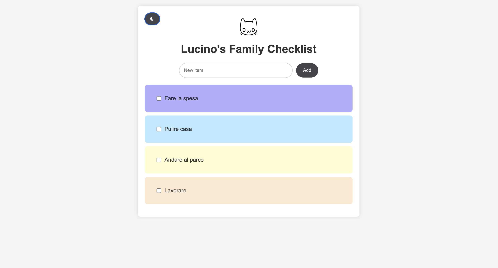
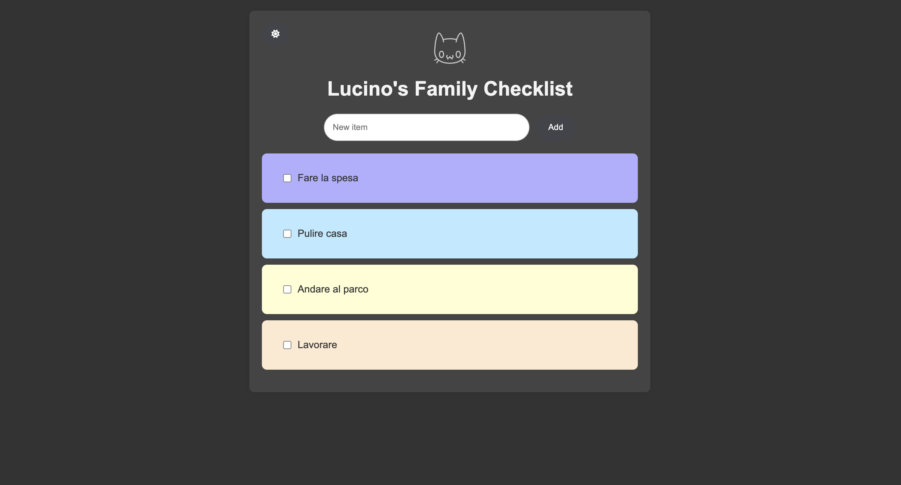
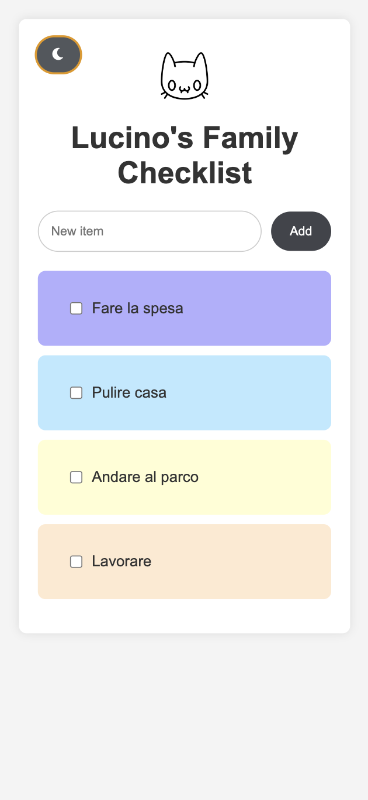
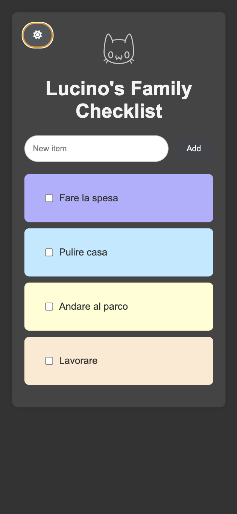

# Checklistcat

## Descrizione

Checklistcat è un'applicazione di gestione delle attività realizzata con Node.js, Express e EJS. L'app consente di aggiungere, visualizzare e completare attività, con la possibilità di passare tra modalità chiara e scura. Ogni attività può essere colorata in base a una palette di colori predefinita.

## Funzionalità

- **Aggiungi Attività**: Inserisci nuove attività nella checklist.
- **Visualizza Attività**: Le attività sono visualizzate con colori casuali da una palette personalizzata.
- **Completa Attività**: Segna le attività come completate utilizzando una checkbox.
- **Modalità Scura/Chiara**: Passa tra la modalità chiara e scura per migliorare l'esperienza visiva in diverse condizioni di illuminazione.
- **Interfaccia Intuitiva**: Il design include un'icona e pulsanti stilizzati per un'esperienza utente fluida.

## Modalità Scura

L'app supporta la modalità scura e chiara. Il toggle per cambiare modalità è posizionato in alto a sinistra. Assicurati che il pulsante e le icone siano visibili e stilizzati correttamente in entrambe le modalità.

## Screenshots

